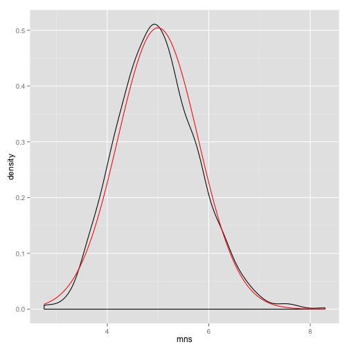
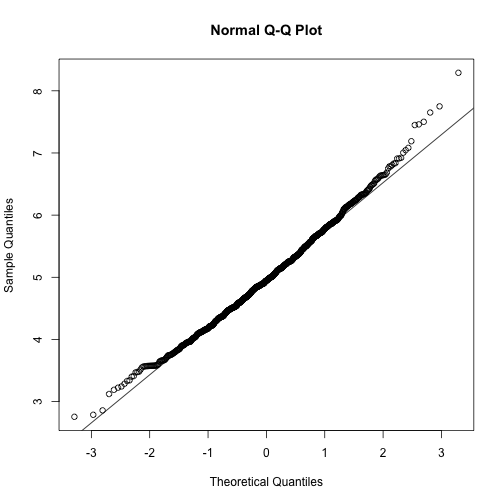

## Overview
In this project we will investigate the exponential distribution and compare it 
with the Central Limit Theorem. We will conduct a series of 1000 simulations, in 
each we will calculate the mean of 40 random exponentials. According to the 
Central Limit Theorem we expect that these 1000 means will have a distribution 
which is approximately normal.

## Simulations

We start with loading the necesarry r libraries and defining are global parameters
for the expiriment. Also, we set a seed so the results of this expirements could
be repeated.

```r
# load libraries and define our experiments parameters
library("ggplot2")
set.seed(27)
lambda <- 0.2
nosim <- 1000
n <- 40
```

Now, we will run 1000 expirements. In each we will pick 40 random
variables from the exponential destribution using using the *rexp* function, 
calculate their mean, and save the results. Using these results, we will draw a 
density function (black), and add a theoretical normal density function (red)
with the expected mean and sd values.

```r
# running the simulation
mns = NULL
for (i in 1 : nosim) mns = c(mns, mean(rexp(n, rate = lambda)))

# draw plots
base <- qplot(mns, geom = "density")
base + stat_function(fun = dnorm, colour = "red", 
                     arg = list(mean = 1/lambda, sd=1/lambda/sqrt(n)))
```

 

## Sample Mean versus Theoretical Mean
According to the Central Limit Theorem the sample mean should be equal to the mean
of the distribution, which in the case of exponential distribution equals to
1/lambda. We can see that we got very similar results.


```r
sample_mean <- mean(mns);
```
* Sample Mean:  4.9878807
* Theoretical Mean: 5

## Sample Variance versus Theoretical Variance

According to the Central Limit Theorem the sample variance should be equal to 
the variance of the distribution devided by the sampling size (i.e. 40). In the 
case of exponential distribution we expect the variance to be 1/lambda^2 * n.
We can see that we got here as well very similar results, and we expect them
to get even closer as we increase our sampling size.


```r
sample_variance <- var(mns);
```
* Sample Variance: 0.6248022
* Theoretical Variance: 0.625

## Distribution

Besides the fact the the mean and variance of the sample distribution are close
to the theretical normal distribution, another way to show that the the sample
distribution is approximately normal is by drawing a Quantile-Quantile Plot.


```r
qqnorm(mns);
qqline(mns)
```

 

We can see the the sample distribution followes pretty much the theoretical 
distribution, meaning our sample distribution is indeed approximately normal.
