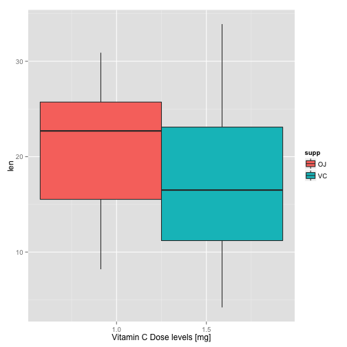

```r
## Load ToothGrowth data
library(datasets)
library(ggplot2)
data(ToothGrowth)
p <- ggplot(ToothGrowth, aes(factor(supp), x = dose, y=len, fill=supp))
p + geom_boxplot() + labs(x="Vitamin C Dose levels [mg]")
```

 

```r
summary(ToothGrowth)
```

```
##       len        supp         dose      
##  Min.   : 4.20   OJ:30   Min.   :0.500  
##  1st Qu.:13.07   VC:30   1st Qu.:0.500  
##  Median :19.25           Median :1.000  
##  Mean   :18.81           Mean   :1.167  
##  3rd Qu.:25.27           3rd Qu.:2.000  
##  Max.   :33.90           Max.   :2.000
```
